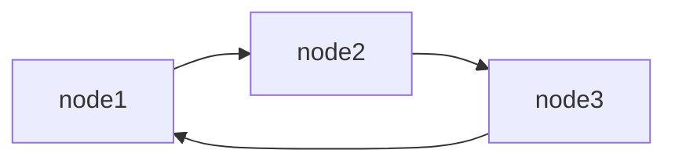
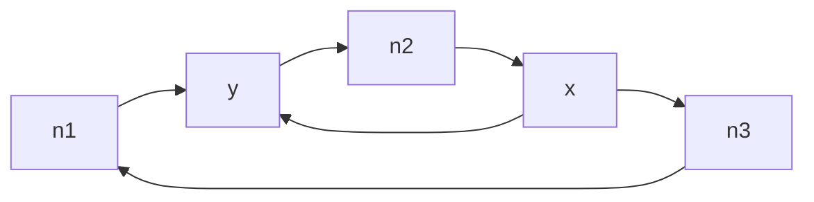

# Leader Election Process

This project implements the **Leader Election problem** using the **Chang–Roberts algorithm** in two topologies:

- **Task 1:** Asynchronous **ring** of 3 nodes  
- **Task 2:** **Partially double ring** of 5 nodes (extra edge `x → y`)

Each node runs as a separate process with its own UUID (generated once at startup).  
Messages are newline-delimited JSON objects:

```json
{"uuid": "node-uuid", "flag": 0}
```

- `flag = 0` → candidate message  
- `flag = 1` → leader announcement  

Each node logs all Sent / Received / Ignored events and prints the final elected leader.

---

## Task 1 -  Ring of 3 Nodes

## Topology




### Config files

Each node has a config with 2 lines:

```
<my_bind_ip>,<my_port>  
<neighbor_ip>,<neighbor_port>
```

For localhost demo:

**config_task1_node1.txt**

```
127.0.0.1,5001
127.0.0.1,5002
```

**config_task1_node2.txt**

```
127.0.0.1,5002
127.0.0.1,5003
```

**config_task1_node3.txt**
```
127.0.0.1,5003
127.0.0.1,5001
```

### How to run

From the repo root:

```bash
./run_task1.sh
```

This launches all 3 nodes in the background. Logs are written to:

- `task1/log1.txt`  
- `task1/log2.txt`  
- `task1/log3.txt`

### Example output (from task1/log1.txt)


All 3 nodes eventually print the same leader.

---

## Task 2 — Partially Double Ring (5 Nodes)

### Topology



### Config files

**config_task2_y.txt**

```
127.0.0.1,5101
127.0.0.1,5102
```

**config_task2_n2.txt**
```
127.0.0.1,5102
127.0.0.1,5103
```

**config_task2_x.txt**
```
127.0.0.1,5103
127.0.0.1,5104
127.0.0.1,5101
```

**config_task2_n3.txt**
```
127.0.0.1,5104
127.0.0.1,5105
```

**config_task2_n1.txt**
```
127.0.0.1,5105
127.0.0.1,5101
```

### How to run

From the repo root:

```bash
./run_task2.sh
```

This launches all 5 nodes in the background. Logs are written to:

- `task2/logy.txt`  
- `task2/logx.txt`  
- `task2/log1.txt`  
- `task2/log2.txt`  
- `task2/log3.txt`

### Example output (from task2/logy.txt)


All 5 nodes eventually print the same leader UUID.

---

## Notes

- **Termination:** Each process exits after ~2–3 seconds of quiet once a leader is known.  
- **Direction:** Clients always send → servers always receive.  
- **Deduplication:**  
  - Candidate UUIDs (`flag=0`) are forwarded only once per node.  
  - Leader announcements (`flag=1`) are forwarded only once.  
- **Logs:** Contain Sent, Received, and Ignored entries in the required format.

---
